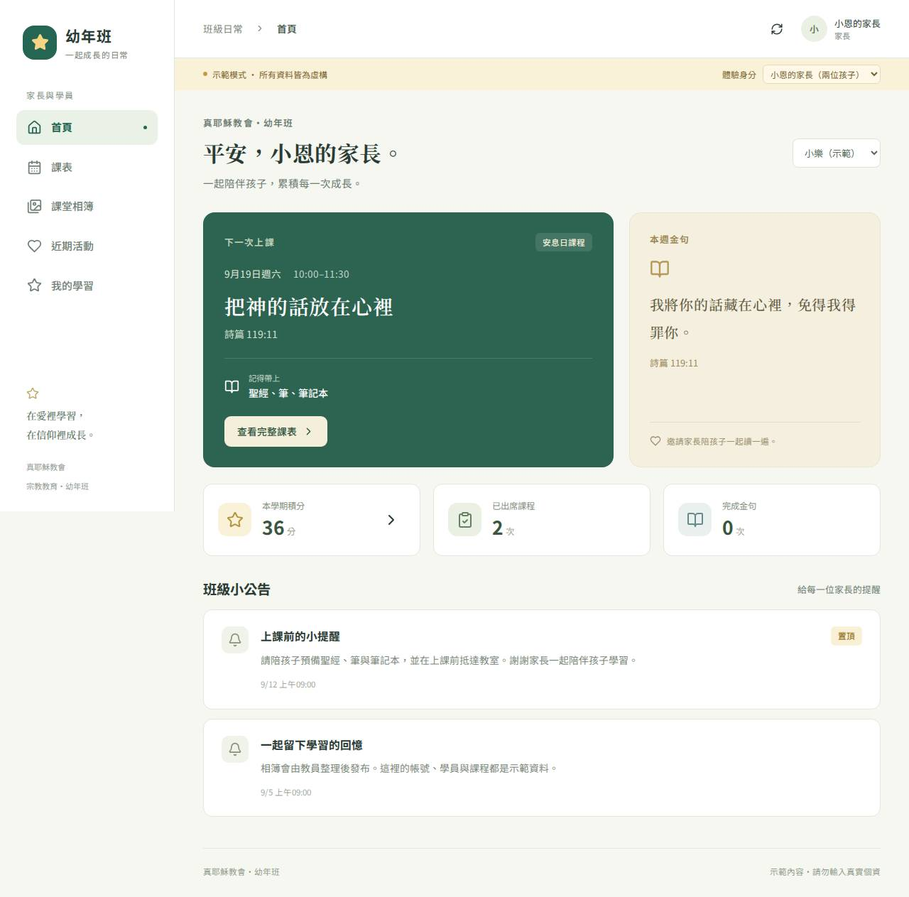

# 幼年班・一起成長
真耶穌教會幼年班的班級管理系統。前台給家長與學員，後台給教員與班負責；網站部署在 GitHub Pages，正式資料放在 Google Sheets 與 Google Drive。

**目前預設為可操作的示範模式，所有人物與課程皆為虛構。Google 正式服務需依設定文件完成一次性部署。** 示範修改只保存在使用者目前的瀏覽器，請勿輸入真實個資。

- [網站（Pages 啟用並部署成功後）](https://timmywu30.github.io/tjc-classroom/)
- [完整系統方案](docs/PLAN.md)
- [從示範切換正式系統：設定教學](docs/SETUP.md)
- [教員與家長操作手冊](docs/GUIDE.md)
- [資料與權限設計](docs/SECURITY.md)
- [建置與測試紀錄](https://github.com/timmywu30/tjc-classroom/actions)

## 畫面預覽

以下為實際瀏覽器測試截圖，內容均為虛構。

[查看手機首頁](docs/screenshots/home-mobile.jpg)

## 已實作功能

| 使用者 | 功能 |
| --- | --- |
| 家長／學員 | Google 登入、同帳號切換孩子、課表與教材連結、本週金句、班級公告、近期活動、已發布相簿、個人積分與出席／金句紀錄 |
| 教員 | 學員新增修改、逐人與批次點名、自動加分、金句登記、手動積分調整與撤銷、課程登記鎖定、公告／活動草稿與發布、相簿上傳／封面／發布、積分 CSV 匯出、複製上課提醒 |
| 班負責 | 教員全部功能、Google 帳號開通與孩子關聯、角色與停用、Google 學員來源表預覽匯入、學期封存、積分規則、雲端資料連結、JSON 備份、操作紀錄 |
| 系統 | 後端權限過濾、穩定操作編號避免重複寫入、照片壓縮、每日資料備份、GitHub Actions 自動測試與發布 |

家長不會看到全班積分排名。相簿依班級發布，教員需確認照片內容與分享同意。

## 架構

- React + TypeScript + Vite：手機與桌面介面、靜態網站。
- GitHub Pages：只保存網站程式及虛構示範資料。
- Firebase Authentication：Google 身分登入；不使用 Firestore 或 Firebase Storage。
- Google Apps Script：驗證身分與權限、讀寫試算表、處理 Drive 照片與備份。
- Google Sheets：班級資料及獨立課表，課表由教員在 Sheets 維護。
- Google Drive：限制存取的照片與資料備份。

Apps Script HTML Service bridge 透過 postMessage 與 google.script.run 傳輸；不使用 JSONP、不在網址放登入憑證、不把私人試算表發布到網路。

## 開發

使用 Node.js 22。

~~~sh
npm ci
npm run dev
~~~

首次尚無 package-lock.json 時使用 npm install。變更共用資料邏輯後同步 Apps Script：

~~~sh
npm run backend:sync
npm test
npm run build
npx playwright install chromium
npm run test:ui
~~~

瀏覽器測試使用建置後的網站。Google 身分驗證及實際 Drive／Sheets 的整合，仍須在自己的正式專案完成驗收；模擬測試不代表 Google 端已部署。

## 專案位置

| 路徑 | 用途 |
| --- | --- |
| src/App.tsx、src/styles.css | 前後台介面 |
| src/domain.js | 後端與示範共用的資料規則、權限及積分邏輯 |
| src/service.ts | Google 登入、bridge、重試與照片壓縮 |
| public/config.js | 示範／正式模式與公開 Firebase 設定 |
| apps-script/ | 完整 Google 後端與初始化程式 |
| templates/ | 課表與學員匯入範本 |
| tests/ | 權限、積分、後端與瀏覽器測試 |
| docs/ | 方案、設定、操作與資料維護說明 |

本專案為班級管理用途，介面及示範課程不代表教會正式教材或官方公告。
